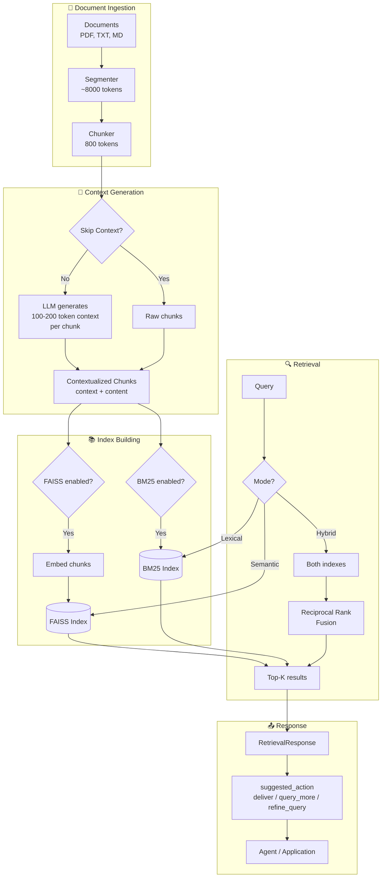

# Konte

[](https://github.com/leksikov/konte/actions/workflows/ci.yml)
[](https://www.python.org/downloads/)
[](https://github.com/leksikov/konte/blob/main/LICENSE)

Contextual RAG library that improves retrieval by prepending LLM-generated context to chunks before embedding and indexing.

## Problem

Traditional RAG destroys context when chunking. A chunk like "The company's revenue grew by 3% over the previous quarter" lacks information about which company or quarter, causing retrieval failures.

## Solution

Konte implements [Anthropic's Contextual Retrieval](https://www.anthropic.com/news/contextual-retrieval) approach:

1. **Contextual Embeddings** - Before embedding each chunk, prepend a short context (100-200 tokens) generated by an LLM that sees the full segment (~8000 tokens)
2. **Contextual BM25** - Apply the same contextualization before building the BM25 lexical index
3. **Hybrid Retrieval** - Combine semantic (FAISS) and lexical (BM25) search with reciprocal rank fusion

This achieves up to **49% reduction** in failed retrievals (67% with reranking). On our own benchmark, contextual chunks + reranking improved answer accuracy by **+12% to +25%** over a no-context baseline — see [Evaluation](#evaluation).

## Installation

Using [uv](https://docs.astral.sh/uv/) (recommended):

```bash
git clone https://github.com/leksikov/konte.git
cd konte
uv sync                   # library + CLI + dev tools, into .venv
```

Or with pip:

```bash
pip install -e .          # library + CLI
```

Set your OpenAI API key (used for embeddings and context generation):

```bash
export OPENAI_API_KEY=sk-...
```

Any vLLM server with an OpenAI-compatible API can be used instead for context and answer generation — see [Configuration](#configuration). Note that embeddings always use OpenAI while FAISS is enabled (the default), so the key is only optional for BM25-only projects.

## Quick Start

```python
import asyncio
from pathlib import Path
from konte import Project

async def main():
    # Create a project
    project = Project.create("my_knowledge_base")

    # Add documents
    project.add_documents([
        Path("doc1.pdf"),
        Path("doc2.txt"),
        Path("doc3.md"),
    ])

    # Build indexes (generates context, creates FAISS + BM25 indexes)
    await project.build()

    # Save project for later use
    project.save()

    # Query
    response = project.query("What was the revenue growth?")

    for result in response.results:
        print(f"[{result.score:.2f}] {result.content[:200]}...")

    # Check agent hints
    print(f"Suggested action: {response.suggested_action}")
    print(f"High confidence: {response.has_high_confidence}")

asyncio.run(main())
```

## CLI

```bash
# Create a project
konte create my_project

# Add documents
konte add my_project doc1.pdf doc2.md

# Build indexes
konte build my_project

# Query (retrieval only)
konte query my_project "What was the revenue growth in Q3?"

# Ask (full RAG with LLM answer)
konte ask my_project "What was the revenue growth in Q3?"
konte ask my_project "Which products drove the growth?" --show-sources

# List projects / show info / delete
konte list
konte info my_project
konte delete my_project

# REST API server (requires the [api] extra: uv sync --extra api)
konte serve --host 0.0.0.0 --port 8000

# Web UI (requires the [ui] extra: uv sync --extra ui)
konte ui --port 7860

# Version
konte --version
```

## Loading Existing Projects

```python
from konte import Project, get_project

# Option 1: Using Project.open()
project = Project.open("my_knowledge_base")

# Option 2: Using manager function
project = get_project("my_knowledge_base")

# Query immediately
response = project.query("your query here")
```

## Project Management

```python
from konte import (
    create_project,
    list_projects,
    get_project,
    delete_project,
    project_exists,
)

# Create new project
project = create_project("my_project")

# List all projects
projects = list_projects()  # Returns: ["my_project", ...]

# Check if project exists
if project_exists("my_project"):
    project = get_project("my_project")

# Delete project
delete_project("my_project")
```

## Retrieval Modes

```python
# Hybrid (default) - FAISS + BM25 with rank fusion
response = project.query("query", mode="hybrid")

# Semantic only - FAISS embeddings
response = project.query("query", mode="semantic")

# Lexical only - BM25 keyword matching
response = project.query("query", mode="lexical")
```

## Skip Context Generation

For standard RAG without LLM-generated context (faster, cheaper):

```python
await project.build(skip_context=True)
```

## Custom Context Prompts

The context-generation prompt is a plain text template with two placeholders: `{segment}` (the ~8000-token surrounding segment) and `{chunk}` (the chunk to contextualize). The default prompt (`konte/prompts/context_prompt.txt`) is domain-neutral and responds in the document's language.

Domain-specific prompts substantially improve retrieval for specialized corpora. Override per project:

```python
project = Project.create("my_project", context_prompt_path=Path("my_prompt.txt"))
```

or via the CLI:

```bash
konte create my_project --prompt my_prompt.txt
konte build my_project --prompt my_prompt.txt
```

or globally with the `PROMPT_PATH` environment variable. See [examples/prompts/](https://github.com/leksikov/konte/tree/main/examples/prompts/) for domain-specific prompt examples (Korean customs-tariff classification).

## RAG Answer Generation

`query_with_answer()` is the full RAG pipeline: retrieve chunks, then generate an LLM-grounded answer.

```python
import asyncio
from konte import Project

async def main():
    project = Project.open("my_project")

    # Full RAG pipeline: retrieval + LLM answer
    response, answer = await project.query_with_answer(
        query="What was the revenue growth in Q3?",
        mode="hybrid",
        max_chunks=5,
    )

    print(answer.answer)       # LLM-generated answer
    print(answer.model)        # Model used (e.g., "gpt-4.1-mini")
    print(answer.sources_used) # Number of chunks used

    # Retrieval metadata is also available
    print(response.top_score)        # Highest retrieval score (0-1)
    print(response.suggested_action) # "deliver", "query_more", or "refine_query"

asyncio.run(main())
```

Answers are generated with OpenAI by default, or with your own vLLM endpoint when `BACKENDAI_ENDPOINT` and `BACKENDAI_MODEL_NAME` are configured.

### Custom Prompt Templates

Override the default answer prompt with `{context}` and `{question}` placeholders:

```python
custom_prompt = """Based on the following documents, answer the question.

Documents:
{context}

Question: {question}

Provide the answer with references to source documents.
Answer:"""

response, answer = await project.query_with_answer(
    query="What are the main risk factors?",
    prompt_template=custom_prompt,
    max_chunks=10,
)
```

### With Reranking

Combine answer generation with reranking for better retrieval quality. Reranking requires a vLLM server exposing a `/score` endpoint (e.g. serving Qwen3-Reranker-8B), configured via `RERANKER_BASE_URL`:

```python
response, answer = await project.query_with_answer(
    query="How do the two products compare?",
    rerank=True,           # Rerank via RERANKER_BASE_URL before answer generation
    rerank_initial_k=50,   # Retrieve 50 candidates, rerank to top_k
    max_chunks=5,
)
```

## Metadata Filtering

Filter retrieval results by source filename or custom metadata fields.

### source_filter — Substring Match

`source_filter` matches against the chunk's source filename (case-sensitive substring):

```python
# Only return chunks from Samsung documents
response = project.query("revenue growth", source_filter="SAMSUNG")

# Only return chunks from 2024 reports
response = project.query("revenue growth", source_filter="2024")

# Combine with retrieval mode
response = project.query("DRAM market", mode="semantic", source_filter="SAMSUNG_2024")
```

### metadata_filter — Equality Match

`metadata_filter` filters by exact values in chunk metadata (AND logic for multiple keys):

```python
# Filter by exact source filename
response = project.query(
    "semiconductor revenue",
    metadata_filter={"source": "TSMC_2024_ANNUAL.md"},
)

# Filter by multiple fields (AND logic)
response = project.query(
    "quarterly results",
    metadata_filter={"company": "SAMSUNG", "year": 2024},
)

# List values match any (OR within a key)
response = project.query(
    "chip production",
    metadata_filter={"company": ["SAMSUNG", "TSMC"]},
)
```

### With Answer Generation

Filters work with `query_with_answer()` too:

```python
response, answer = await project.query_with_answer(
    query="What was the revenue?",
    source_filter="SAMSUNG_2024",
    max_chunks=5,
)
```

See [examples/metadata_filtering.py](https://github.com/leksikov/konte/blob/main/examples/metadata_filtering.py) for a complete example.

## Agent Integration

Konte returns retrieval responses with decision hints for agent workflows:

```python
response = project.query("query")

# Suggested action based on confidence
print(response.suggested_action)
# "deliver" (score >= 0.7), "query_more" (0.4-0.7), or "refine_query" (< 0.4)

print(response.has_high_confidence)  # True if top_score >= 0.7
print(response.top_score)            # Highest result score (0-1)
print(response.score_spread)         # Difference between top and bottom scores

# Use as a plain callable tool
retriever = project.as_retriever()
response = retriever("my query")
```

Konte integrates with LangChain and Agno agent frameworks. See the [Agent Integration Guide](https://github.com/leksikov/konte/blob/main/docs/AGENT_INTEGRATION_GUIDE.md) for:

- LangChain RAG chains and custom retrievers
- Agno tools and multi-project agents
- Confidence-based agent decisions
- Streaming responses

## RetrievalResponse Schema

All models are Pydantic V2:

```python
class RetrievalResponse:
    results: list[RetrievalResult]  # Ranked results
    query: str                      # Original query
    total_found: int                # Number of results
    top_score: float                # Highest score (0-1)
    score_spread: float             # Score range
    has_high_confidence: bool       # top_score >= 0.7
    suggested_action: str           # "deliver", "query_more", "refine_query"

class RetrievalResult:
    content: str      # Original chunk text
    context: str      # LLM-generated context
    score: float      # Relevance score (0-1)
    source: str       # Source filename
    chunk_id: str     # Unique chunk identifier
    metadata: dict    # Additional metadata
```

## Multi-Project Retrieval

Query multiple knowledge bases in parallel:

```python
from konte import Project

projects = [
    Project.open("annual_reports"),
    Project.open("product_docs"),
    Project.open("support_tickets"),
]

# Query all projects
results = {}
for project in projects:
    results[project.config.name] = project.query("battery performance issues")

# Merge and rank
all_results = []
for name, response in results.items():
    for r in response.results:
        all_results.append((name, r))

all_results.sort(key=lambda x: x[1].score, reverse=True)
```

See [examples/parallel_multi_project_retrieval.py](https://github.com/leksikov/konte/blob/main/examples/parallel_multi_project_retrieval.py) for a complete example.

## Performance Optimizations

### vLLM/OpenAI Prefix Caching

Context generation is optimized for KV cache prefix caching:

```
Prompt structure: [SEGMENT ~8000 tokens] + [CHUNK ~800 tokens]
```

**How it works:**
1. All chunks within a segment share the same prefix (segment text)
2. Chunks are sent in parallel via `abatch(max_concurrency=len(chunks))`
3. First request computes and caches the segment prefix KV states
4. Subsequent chunk requests hit the cache - only compute the unique chunk suffix
5. Segments are processed sequentially to maximize cache efficiency

```
Segment A (10 chunks):
  Request 1: segment_A + chunk_1  → compute prefix, cache it
  Request 2: segment_A + chunk_2  → cache hit, compute only chunk_2
  Request 3: segment_A + chunk_3  → cache hit, compute only chunk_3
  ...
Then Segment B, etc.
```

Request order within a segment doesn't matter - whichever arrives first triggers caching.

### Other Optimizations

- **LLM Instance Caching**: Reuses ChatOpenAI instance across calls
- **Batch Processing**: Uses LangChain's `abatch()` for parallel LLM calls within segment
- **Build Checkpointing**: Per-segment checkpoints allow interrupted builds to resume

## Logging

Structured logging via structlog provides visibility into the ingestion pipeline:

```
2024-01-15 10:30:01 [info] loading_document path=/data/doc.pdf
2024-01-15 10:30:02 [info] document_chunked path=/data/doc.pdf num_chunks=55
2024-01-15 10:30:02 [info] context_generation_started total_segments=5 skip_context=False
2024-01-15 10:30:03 [info] generating_context_for_segment segment_key=('doc.pdf', 0) total_segments=5 num_chunks=11
...
2024-01-15 10:30:15 [info] context_generation_complete num_chunks=55 skipped=False
2024-01-15 10:30:16 [info] faiss_index_built
2024-01-15 10:30:16 [info] project_build_complete
```

Pipeline: 1 document → 5 segments (~8000 tokens each) → ~11 chunks per segment (~800 tokens) = 55 chunks total. Use debug level for granular token counts.

## Index Options

```python
# FAISS only (no BM25)
project = Project.create("semantic_only", enable_bm25=False)

# BM25 only (no FAISS) - no embeddings needed
project = Project.create("lexical_only", enable_faiss=False)
```

## Configuration

Set via environment variables or `.env` file (see [.env.example](https://github.com/leksikov/konte/blob/main/.env.example)):

```bash
OPENAI_API_KEY=sk-...          # Required for embeddings (FAISS, the default)
STORAGE_PATH=~/.konte          # Project storage location
EMBEDDING_MODEL=text-embedding-3-small
CONTEXT_MODEL=gpt-4.1-mini     # Model for context/answer generation
DEFAULT_TOP_K=20
PROMPT_PATH=                   # Optional global context-prompt override

# Optional: any vLLM server with an OpenAI-compatible API
# (replaces OpenAI for context/answer generation only - not embeddings)
BACKENDAI_ENDPOINT=https://your-vllm-endpoint/v1
BACKENDAI_MODEL_NAME=your-model-name

# Optional: reranker (vLLM /score endpoint), required only for rerank=True
RERANKER_BASE_URL=https://your-vllm-endpoint/v1
RERANKER_MODEL=Qwen3-Reranker-8B
```

## Examples

| Example | Demonstrates |
|---------|-------------|
| [basic_usage.py](https://github.com/leksikov/konte/blob/main/examples/basic_usage.py) | Project CRUD, document loading, building, querying, retrieval modes |
| [query_with_answer.py](https://github.com/leksikov/konte/blob/main/examples/query_with_answer.py) | Full RAG pipeline, custom prompt templates, GeneratedAnswer model |
| [metadata_filtering.py](https://github.com/leksikov/konte/blob/main/examples/metadata_filtering.py) | source_filter, metadata_filter, combining filters with modes |
| [async_reranking.py](https://github.com/leksikov/konte/blob/main/examples/async_reranking.py) | Async querying, reranking, comparing with/without reranking |
| [parallel_multi_project_retrieval.py](https://github.com/leksikov/konte/blob/main/examples/parallel_multi_project_retrieval.py) | Multi-project querying, result merging |
| [prompts/](https://github.com/leksikov/konte/tree/main/examples/prompts/) | Domain-specific context prompt templates |

## Evaluation

Evaluated end-to-end with DeepEval LLM-as-judge metrics on a customs-tariff classification case study (private Korean corpus, ~3,000 chunks):

| Configuration | Exact lookup (100 q) | Diverse RAG (70 q) |
|---------------|----------------------|--------------------|
| **Contextual chunks + reranking** | **97%** | **98.6%** |
| Baseline (no context, no reranking) | 85% | 74% |

Contextual retrieval provides the largest gains (+25%) on complex multi-context questions. Full results, methodology, and instructions for evaluating your own corpus: [docs/EVALUATION.md](https://github.com/leksikov/konte/blob/main/docs/EVALUATION.md).

## Architecture



Detailed diagrams: [architecture overview](https://github.com/leksikov/konte/blob/main/docs/architecture_overview.md) · [detailed pipeline](https://github.com/leksikov/konte/blob/main/docs/architecture_detailed.md)

## Troubleshooting

**macOS: `OMP: Error #15` / libomp crash when importing FAISS**

FAISS and other libraries may both load OpenMP. Set:

```bash
export KMP_DUPLICATE_LIB_OK=TRUE
```

## Contributing

Contributions welcome — see [CONTRIBUTING.md](https://github.com/leksikov/konte/blob/main/CONTRIBUTING.md). Run `uv run pytest tests/unit` (no API keys needed) and `uv run ruff check .` before submitting a PR.

## License

[MIT](https://github.com/leksikov/konte/blob/main/LICENSE)
