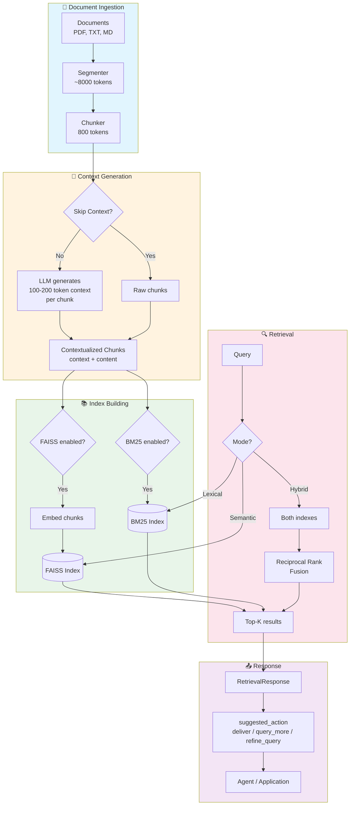

# Architecture Overview

High-level view of Konte's pipeline: documents are segmented and chunked, each chunk is contextualized by an LLM that sees the full surrounding segment, and the contextualized chunks feed both a FAISS semantic index and a BM25 lexical index. Queries run against either or both indexes, with hybrid results combined via reciprocal rank fusion.

For the detailed implementation flow (token counting, retries, score calculation), see [architecture_detailed.md](architecture_detailed.md).
